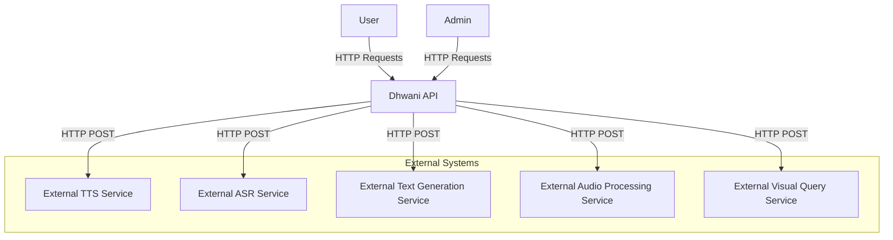
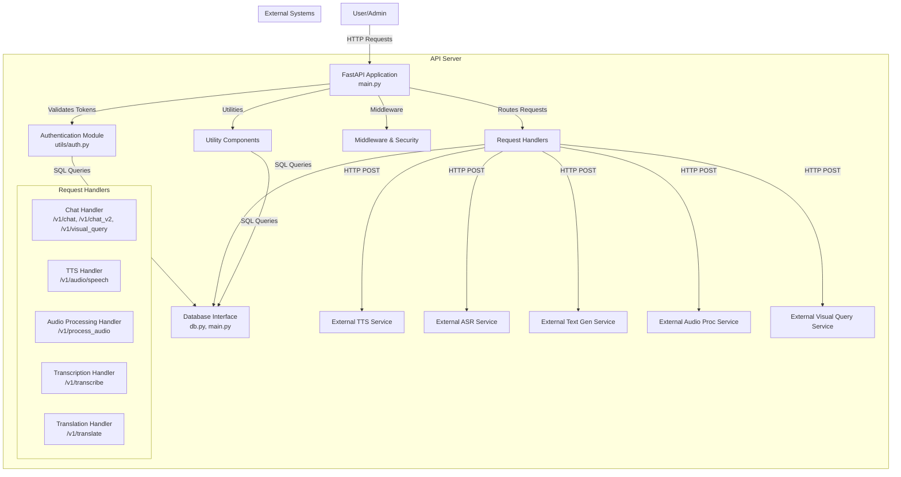

# Dhwani API C4 Architecture Diagrams

---

## 1. Context Diagram

The Context diagram shows the high-level system and its interactions with external actors and systems.

### System
- **Name**: Dhwani API
- **Description**: A multilingual AI-powered API supporting Indian languages for chat, text-to-speech, audio processing, and transcription.

### Actors
- **User**: Interacts with the API via HTTP requests for authentication, chat, TTS, audio processing, and translation.
- **Admin**: A special user with additional privileges to manage users, configurations, and database exports/imports.

### External Systems
- **External TTS Service**: Provides text-to-speech functionality (URL: `settings.external_tts_url`).
- **External ASR Service**: Provides audio transcription (URL: `settings.external_asr_url`).
- **External Text Generation Service**: Handles chat responses (URL: `settings.external_text_gen_url`).
- **External Audio Processing Service**: Processes audio files (URL: `settings.external_audio_proc_url`).
- **External Visual Query Service**: Handles visual queries with images (URL: implied from code).

### Interactions
- **User/Admin -> Dhwani API**: HTTP requests (POST/GET) for endpoints like `/v1/chat`, `/v1/audio/speech`, `/v1/register`, etc.
- **Dhwani API -> External TTS Service**: HTTP POST requests for speech generation.
- **Dhwani API -> External ASR Service**: HTTP POST requests for transcription.
- **Dhwani API -> External Text Generation Service**: HTTP POST requests for chat responses.
- **Dhwani API -> External Audio Processing Service**: HTTP POST requests for audio processing.
- **Dhwani API -> External Visual Query Service**: HTTP POST requests for visual queries.

---

## 2. Container Diagram

The Container diagram breaks down the Dhwani API into its major containers (deployable units) and their interactions.

### System
- **Name**: Dhwani API

### Containers
1. **API Server**
   - **Technology**: FastAPI (Python 3.10), running in a Docker container (`python:3.10-slim`)
   - **Responsibilities**: Handles HTTP requests, authentication, rate limiting, circuit breaking, and routing to external services.
   - **Exposed Port**: 7860
   - **Endpoints**: `/v1/chat`, `/v1/audio/speech`, `/v1/transcribe`, `/v1/translate`, `/v1/register`, etc.

2. **SQLite Database**
   - **Technology**: SQLite (`users.db` file)
   - **Responsibilities**: Stores user credentials (username, encrypted password, is_admin) and task statuses for bulk operations.
   - **Interaction**: Accessed via the `databases` library in Python.

### External Systems
- External TTS Service
- External ASR Service
- External Text Generation Service
- External Audio Processing Service
- External Visual Query Service

### Interactions
- **User/Admin -> API Server**: HTTP requests via browser or client apps (authenticated via JWT tokens).
- **API Server -> SQLite Database**: SQL queries for user authentication, task management, and data import/export.
- **API Server -> External TTS Service**: HTTP POST (`aiohttp`) with JSON payload for speech generation.
- **API Server -> External ASR Service**: HTTP POST (`aiohttp`) with audio file for transcription.
- **API Server -> External Text Generation Service**: HTTP POST (`aiohttp`) with prompt for chat responses.
- **API Server -> External Audio Processing Service**: HTTP POST (`aiohttp`) with audio file for processing.
- **API Server -> External Visual Query Service**: HTTP POST (`aiohttp`) with image and query for visual responses.

---

## 3. Component Diagram

The Component diagram details the internal components within the API Server container.

### Container
- **Name**: API Server

### Components
1. **FastAPI Application (app)**
   - **Responsibilities**: Defines routes, middleware (CORS, security headers), exception handling, and lifespan management.
   - **Modules**: `main.py`
   - **Dependencies**: Uvicorn (for running the server), SlowAPI (rate limiting), Pybreaker (circuit breaking).

2. **Authentication Module**
   - **Responsibilities**: Handles user login, registration, token generation (JWT), and admin checks.
   - **Modules**: `utils/auth.py`
   - **Dependencies**: PyJWT, Passlib (bcrypt), Cryptography (Fernet for encryption).
   - **Interactions**: Queries SQLite Database for user data.

3. **Request Handlers**
   - **Responsibilities**: Process specific API requests (chat, TTS, audio processing, transcription, translation).
   - **Subcomponents**:
     - **Chat Handler** (`/v1/chat`, `/v1/chat_v2`, `/v1/visual_query`): Manages text and image-based chat requests.
     - **TTS Handler** (`/v1/audio/speech`): Converts text to speech via external service.
     - **Audio Processing Handler** (`/v1/process_audio`): Processes audio files.
     - **Transcription Handler** (`/v1/transcribe`): Transcribes audio files.
     - **Translation Handler** (`/v1/translate`): Translates text.
   - **Dependencies**: aiohttp (for external API calls), Pydantic (request/response models).

4. **Database Interface**
   - **Responsibilities**: Manages SQLite connections and queries.
   - **Modules**: `src/server/db.py` (implied), `main.py` (SQL queries in lifespan).
   - **Dependencies**: `databases` library.

5. **Utility Components**
   - **Responsibilities**: Health checks, metrics, configuration updates, database export/import.
   - **Endpoints**: `/v1/health`, `/v1/metrics`, `/v1/update_config`, `/v1/export_db`, `/v1/import_db`.
   - **Dependencies**: Logging (`logging_config`), `os`, `shutil`.

6. **Middleware & Security**
   - **Responsibilities**: Adds CORS, security headers, rate limiting, and circuit breaking.
   - **Dependencies**: CORSMiddleware, SlowAPI, Pybreaker.

### Interactions
- **FastAPI Application -> Authentication Module**: Validates tokens for protected routes (`Depends(get_current_user)`).
- **FastAPI Application -> Request Handlers**: Routes HTTP requests to appropriate handlers.
- **Request Handlers -> External Services**: Makes HTTP calls via `aiohttp` with circuit breakers.
- **Authentication Module -> Database Interface**: Queries user data for validation and registration.
- **Request Handlers -> Database Interface**: Manages task statuses for bulk registration.
- **Utility Components -> Database Interface**: Exports/imports SQLite database.
- **Middleware & Security -> FastAPI Application**: Applies policies to all requests/responses.

---


```mermaid
graph TD
    User[User] -->|HTTP Requests| APIServer[API Server<br>FastAPI, Python 3.10, Docker]
    Admin[Admin] -->|HTTP Requests| APIServer
    APIServer -->|SQL Queries| SQLiteDB[SQLite Database<br>users.db]
    APIServer -->|HTTP POST| ExternalTTS[External TTS Service]
    APIServer -->|HTTP POST| ExternalASR[External ASR Service]
    APIServer -->|HTTP POST| ExternalTextGen[External Text Generation Service]
    APIServer -->|HTTP POST| ExternalAudioProc[External Audio Processing Service]
    APIServer -->|HTTP POST| ExternalVisualQuery[External Visual Query Service]
    
    subgraph Dhwani API
        APIServer
        SQLiteDB
    end
    
    subgraph External Systems
        ExternalTTS
        ExternalASR
        ExternalTextGen
        ExternalAudioProc
        ExternalVisualQuery
    endSystem: 
```

